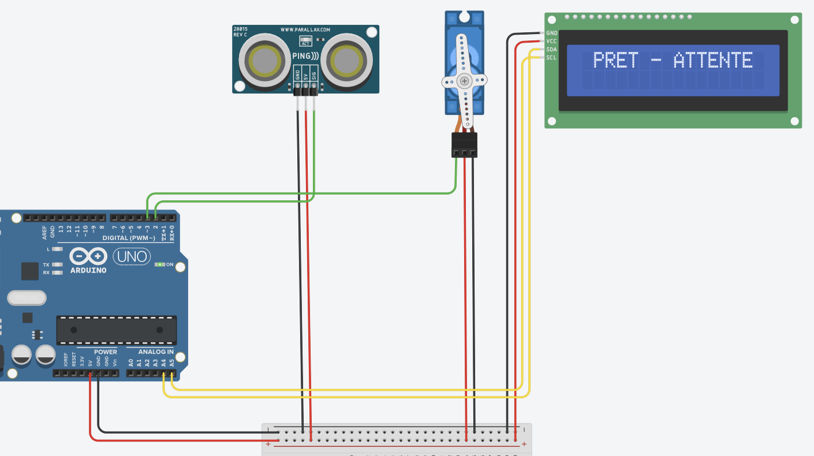

<div style="text-align: center;">
  <a href="README.fr.md">Lire en Français</a>
</div>

# Arduino Surface Sonar System

This project combines an Arduino board, a servo motor, and an ultrasonic distance sensor to create a telemetry system. The servo motor moves the sensor to scan a 180-degree area. The system uses the distance data to create a text-based map of obstacles, which is displayed on both an LCD screen and the computer's Serial Monitor.


## Required Hardware

* Arduino board (Uno, Nano, etc.)
* Servo motor (e.g., SG90)
* Ultrasonic distance sensor (e.g., HC-SR04)
* I2C 16x2 LCD Display
* Jumper wires
* Breadboard


## Wiring Connections

Make sure all components are powered correctly (5V and GND).

* **Servo Motor:**
    * Signal wire (Orange or Yellow) connects to pin `D3` on the Arduino.
* **Ultrasonic Sensor (HC-SR04):**
    * Connect both the `Trig` and `Echo` pins **together** to pin `D2` on the Arduino.
* **I2C LCD Display:**
    * `SDA` connects to pin `A4` (or the labeled `SDA` pin on newer boards).
    * `SCL` connects to pin `A5` (or the labeled `SCL` pin on newer boards).


## Wiring Diagram

Below is an example of the wiring for this project.




## Installation

1.  **Arduino Libraries:**
    Make sure you have installed these libraries using the Library Manager in the Arduino IDE:
    * `Servo` (usually included by default)
    * `Wire` (usually included by default)
    * `Adafruit LiquidCrystal` by Adafruit

2.  **Upload the Code:**
    Open the `arduino_code.cpp` file in the Arduino IDE. Select your board type and the correct port, then upload the code.


## How to Use

1.  Open the **Serial Monitor** in the Arduino IDE.
2.  Set the baud rate to **9600**.
3.  You will see the message: `SYSTEME RADAR INITIALISE`.
4.  Type `start` and press Enter to begin scanning.
5.  Type `stop` and press Enter to stop scanning.


## How it Works

The servo motor sweeps from 0 to 180 degrees in steps of 12 degrees. At every step, the ultrasonic sensor measures the distance to any object in front of it.

### Display Info

* **LCD Screen:** Updates in real-time.
    * **Line 1:** Shows a 16-character map of the surroundings. Each character represents a 12-degree slice of the view.
    * **Line 2:** Shows the current angle (`DEG`), the measured distance (`CM`), or `VIDE` (Empty) if no object is seen.

* **Serial Monitor:** Prints a full map after every complete sweep (left-to-right or right-to-left).
    ```
    MAP - ALLER
    [+++++4269++++++]
    ```

### Map Legend

The system uses symbols to show how far away an object is:

* `+` : No obstacle detected (distance > 315 cm).
* `1` : Obstacle is very close (0-34 cm).
* `2` to `8` : Obstacle is at a medium distance.
* `9` : Obstacle is far away (280-314 cm).

## About the Name

The title **"Arduino Surface Sonar System"** was chosen to accurately reflect both the technology used and its intended environment:

* **Sonar:** At its core, the project's functional principle is best described as **SONAR** (Sound Navigation and Ranging). Much like maritime systems, this device navigates and localizes obstacles by emitting ultrasonic pulses and calculating distance based on the returning echoes.
* **Surface:** While the technology mirrors naval applications, the term **"Surface"** was added to strictly distinguish this project from underwater devices. It clarifies that the system is designed for terrestrial operation, scanning a 2D plane above the ground or a tabletop, rather than submerged depths.